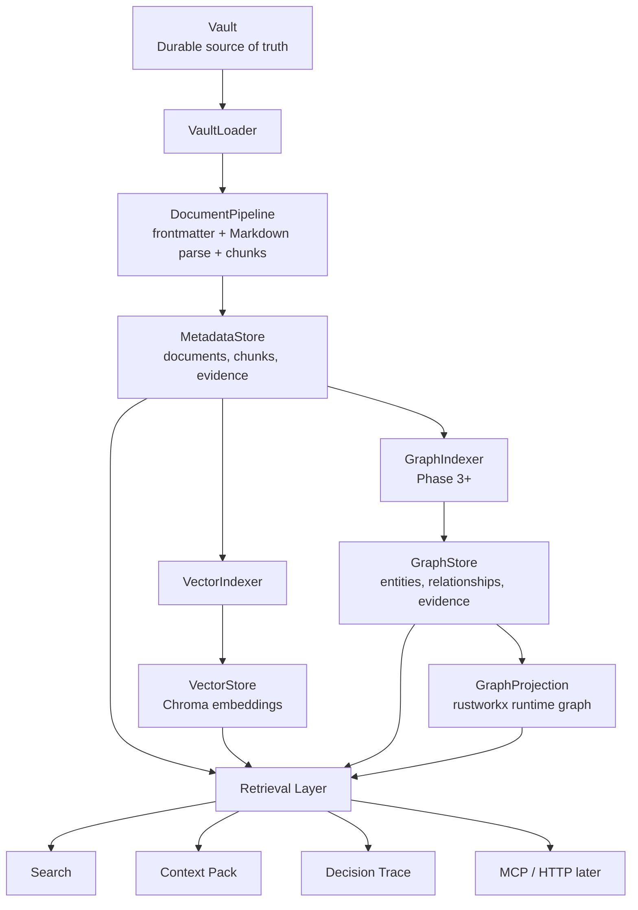
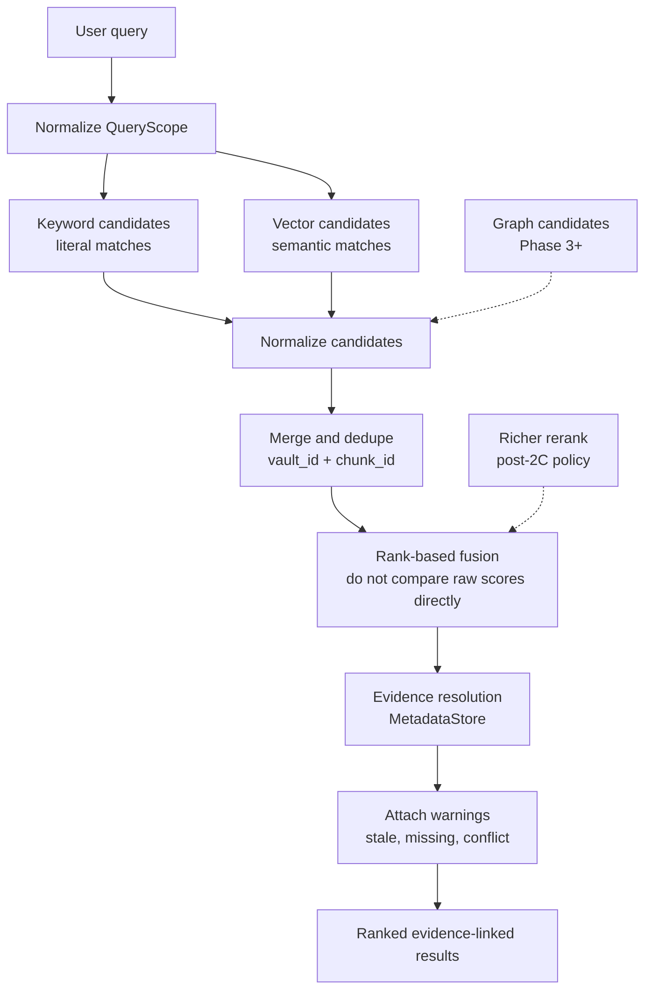

# Vault Graph Search Architecture

This document explains how Vault Graph search is structured around chunks,
batching, indexing, embeddings, vectors, graph projections, and retrieval.

Vault Graph is a read-only, rebuildable access layer over Vault. Vault remains
the durable source of truth. Metadata rows, vector records, graph records,
runtime projections, search results, and context packs are derived state that
can be deleted and rebuilt from Vault.

## Search Status By Phase

Search is intentionally delivered in slices:

- Phase 2A defines internal retrieval contracts and the `VectorStore` boundary.
- Phase 2B builds Chroma-backed local vector projection state and exposes vector
  health through `vg index` and `vg status`.
- Phase 2C adds user-facing `vg search` with keyword and vector hybrid
  retrieval.
- Phase 3 adds graph extraction and graph-based retrieval signals.

Phase 2B does not enable user-facing search. Its job is to make vectors
rebuildable, inspectable, and recoverable from `MetadataStore` chunks.

## High-Level Structure



The important dependency rule is that retrieval and serving layers must resolve
evidence through `MetadataStore` and, once graph indexing exists, `GraphStore`.
`VectorStore` never owns path, title, chunk text, or evidence authority.

## Core Responsibilities

### VaultLoader

`VaultLoader` reads registered Vault roots and applies the selected scope. It
must not mutate Vault files.

### DocumentPipeline

`DocumentPipeline` reads frontmatter, parses Markdown, normalizes sections, and
produces chunk snapshots for indexing.

### MetadataStore

`MetadataStore` owns:

- document identity
- chunk identity
- `(vault_id, path)` mapping
- section and anchor evidence
- content hashes
- parser and chunker version state
- source-state projections
- tombstones
- index revision tracking

It is the evidence authority for document and chunk results. Search output must
resolve document and chunk IDs through `MetadataStore` before rendering normal
results.

### VectorIndexer

`VectorIndexer` reconciles desired vector state from live metadata chunks. It
does not read SQLite tables directly.

```text
VectorIndexer
  -> MetadataStore.list_chunks(effective_scope)
  -> VectorStore.export_manifest(effective_scope)
  -> TextEmbeddings.embed(...)
  -> VectorStore.apply_vector_revision(...)
```

`VectorIndexer` owns the vector reconcile plan:

- find new chunks
- find chunks whose hash, chunker version, metadata revision, or embedding model
  spec changed
- embed only planned upsert texts
- tombstone selected-scope vectors that are stale or no longer desired
- report unchanged counts, stale counts, backend health, and recoverable
  failures

### VectorStore

`VectorStore` owns embedding persistence and vector search. In Phase 2B, Chroma
is the default local vector backend.

`VectorStore` returns semantic candidates only:

- `vault_id`
- `document_id`
- `chunk_id`
- content-scope metadata
- backend-local scores
- backend-local ranks
- embedding model metadata
- vector index revision metadata

It must not return rendered evidence as authority. The caller must resolve
document and chunk evidence through `MetadataStore`.

### GraphStore

`GraphStore` starts in Phase 3. It owns persisted graph records:

- entity records
- relationship records
- evidence references
- tombstones
- relationship status
- confidence
- extraction metadata
- graph revision metadata

Graph records are derived and non-authoritative. Durable truth still lives in
Vault.

### GraphProjection

`GraphProjection` is a bounded runtime graph built from `GraphStore`. It may use
rustworkx and disposable caches for traversal, paths, and graph ranking. It is
not the graph database.

## Chunk Strategy

Chunks are the retrievable text units derived from a document.

The current Phase 2B chunker is `heading-section-v1`. It treats each Markdown
heading section as one retrievable chunk.

This is simple and explainable, but it has known limits:

- large sections can exceed embedding input limits or dilute semantic signal
- small sections can lack enough context
- uneven section sizes create uneven vector granularity
- one small edit inside a large section stales the whole section vector

The long-term migration direction is:

```text
heading-section-v1
  -> markdown-block-window-v2
  -> hierarchical-retrieval-v3
```

`markdown-block-window-v2` keeps Markdown structure as the authority but groups
paragraphs, lists, tables, block quotes, and code fences into token-budgeted
windows. It can include a compact heading breadcrumb in embedded text so small
chunks keep enough search context.

`hierarchical-retrieval-v3` separates the search unit from the context assembly
unit. Fine-grained chunks are used for recall, and parent sections, sibling
chunks, document metadata, links, and future graph relationships are added later
by the retrieval layer.

Chunking belongs in the metadata and indexing pipeline. It must not move into
`VectorStore`.

## Batch Strategy

`embedding_batch_size` is not chunk size.

Chunk size is controlled by the active chunker version. `embedding_batch_size`
controls how many chunk texts are embedded per model call.

Phase 2B defaults:

- `embedding_batch_size`: `256`
- `embedding_parallelism`: `null`, meaning main-process embedding
- `embedding_lazy_load`: `true`

Batching is throughput tuning only. It must not change:

- chunk IDs
- vector IDs
- manifest keys
- status semantics
- failure behavior

`VectorIndexer` must bind every embedding result back to its requested
`input_id`. Duplicate input IDs in a batch are an error.

If embedding fails because batch size or worker count exceeds local runtime
capacity, the vector step must fail clearly. Vault Graph must not silently lower
the batch size, disable parallelism, or switch embedding runtimes during the
same run.

## Index Strategy

Indexing reads Vault and updates only Vault Graph derived state.

### Full Rebuild

`vg index --full`:

1. scans selected VaultCatalog entries
2. computes file state and hashes
3. parses and normalizes included documents
4. rebuilds metadata records
5. rebuilds embeddings when vector indexing is enabled
6. rebuilds graph records in Phase 3+
7. invalidates projection caches in Phase 3+
8. records a new index revision
9. reports warnings and backend health

### Incremental Rebuild

`vg index`:

1. scans selected VaultCatalog entries
2. compares file state with `MetadataStore`
3. classifies files as unchanged, changed, stale, deleted, or tombstoned
4. parses only affected documents
5. updates affected metadata records
6. updates affected vector records when vector indexing is enabled
7. updates affected graph records in Phase 3+
8. invalidates affected projection caches in Phase 3+
9. records a new index revision
10. reports warnings and backend health

Parser, chunker, embedding, extraction, and schema version changes expand the
affected set.

### Dry Run

`vg index --dry-run`:

1. scans selected VaultCatalog entries
2. classifies planned work
3. validates backend availability
4. reports planned document, chunk, and projection changes
5. reports warnings
6. exits without mutating Vault Graph state

Dry-run output is an operational planning artifact, not durable knowledge.

## Embedding Strategy

Phase 2B is local-first.

Default embedding policy:

- implementation: `FastEmbedTextEmbeddings`
- model: `sentence-transformers/paraphrase-multilingual-MiniLM-L12-v2`
- backend artifact: `qdrant/paraphrase-multilingual-MiniLM-L12-v2-onnx-Q`
- dimensions: `384`
- runtime: local CPU
- cache: outside registered Vault roots
- fallback: never silently fall back to another model

`EmbeddingModelSpec` records model name, model version, dimensions, and spec
version. Any model revision, dimension, or spec-version change makes affected
vector records stale.

Runtime tuning such as `embedding_batch_size`, `embedding_parallelism`, and
`embedding_lazy_load` is recorded in run metadata and status diagnostics, but it
is not part of `EmbeddingModelSpec` and must not stale compatible vectors.

## Vector Reconcile

Desired vector state is keyed by:

- `vault_id`
- `document_id`
- `chunk_id`
- `content_scope`
- `source_chunk_hash`
- `chunker_version`
- `metadata_index_revision`
- `EmbeddingModelSpec`

The reconcile plan produces:

- upserts for new chunks
- upserts for chunks whose hash, chunker version, metadata revision, or model
  spec changed
- tombstones for selected-scope manifest rows whose chunks are deleted,
  tombstoned, changed to a new vector ID, or stale under the current model spec
- unchanged counts for status and dry-run output
- warnings for backend, schema, or embedding failures

`vector_index_revision` is lineage and status metadata. It is not a staleness
comparison key.

## Hybrid Search Flow

Hybrid search is easiest to understand as two candidate generators plus an
evidence gate.

Phase 2C exposes this flow through the CLI only. `search_vault(...)`, MCP/HTTP
serving, graph candidates, and richer reranking are later bindings or policy
extensions over the same evidence-first service.



Phase 2C detailed order:

1. Receive `vg search "query"`.
2. Normalize `QueryScope`. Default search uses the active Vault. Cross-Vault
   search requires explicit Vault IDs.
3. Run keyword lookup over metadata and chunks.
4. Embed the query and run vector lookup through `VectorStore`.
5. Normalize keyword and vector outputs into a common candidate shape.
6. Merge and dedupe candidates by Vault-scoped identity.
7. Use rank-based fusion because keyword scores and vector scores are not
   directly comparable.
8. Resolve every normal result through `MetadataStore`.
9. Attach warnings for stale, missing, conflicting, or unsupported evidence.
10. Render ranked evidence-linked results with per-signal explanations.

Post-2C retrieval policy may add richer reranking inputs such as evidence
quality, durable wiki priority, decision page priority, recency when relevant,
and stale penalties. Those inputs must stay in the retrieval layer and must not
change the candidate-store contracts.

Phase 3 adds opt-in graph candidates to the same retrieval contract. Graph
proximity is another signal, not a replacement for metadata evidence resolution.

## Graph Search Direction

Graph retrieval starts with entity lookup or candidate documents, expands
neighborhoods through `GraphStore`, and may use `GraphProjection` for bounded
algorithmic ranking.

The canonical graph evidence unit is the Phase 2 evidence chunk:
`(vault_id, document_id, chunk_id)`. Paths, anchors, and excerpts are rendering
metadata.

Relationship status must remain visible:

- `stated`: directly supported by durable text
- `inferred`: derived by extraction or traversal
- `contested`: conflicting or unresolved evidence exists
- `deprecated`: stale or superseded relationship

Graph expansion must be opt-in across Vaults. If traversal crosses Vault IDs,
the relationship must carry source, target, and evidence Vault IDs plus evidence
explaining why the relationship exists.

## Retrieval Output Principles

Every normal result must be evidence-linked.

A result should carry:

- Vault ID
- document ID
- matched chunk ID
- evidence path
- section or anchor
- content hash
- retrieval reason
- per-signal explanation
- rank or confidence
- warnings, if any
- index and store revision metadata

Candidates without enough evidence may appear only as warnings or inferred
follow-up suggestions.

## Design Summary

Vault Graph search works because responsibilities stay separate:

- `MetadataStore` owns identity and evidence.
- `VectorStore` owns semantic candidate lookup.
- `GraphStore` owns derived graph records.
- `GraphProjection` owns bounded runtime graph algorithms.
- The retrieval layer owns merge, dedupe, ranking, warning attachment, and
  evidence-linked rendering.

This separation keeps the system changeable. Vault Graph can migrate from
`heading-section-v1` to `markdown-block-window-v2`, add
`hierarchical-retrieval-v3`, swap Chroma for Qdrant later, or add graph signals
without turning vector storage into the search policy layer or making derived
state authoritative.
